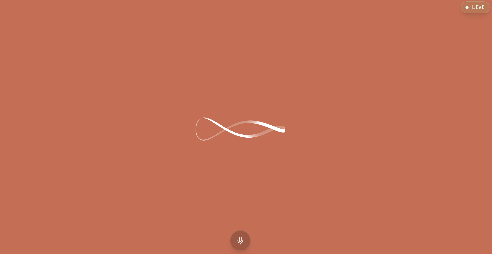

This is a simple Next.js implementation of OpenAI's realtime API with inspirations from her os.

This project uses the [@openai/openai-realtime-api-beta](https://github.com/openai/openai-realtime-api-beta) library for real-time communication with OpenAI's API.

The her os animation was inspired by [@psyonline's CodePen](https://codepen.io/psyonline/pen/yayYWg).

**Note:** Works best in Google Chrome.

[](https://youtu.be/VYS9cEkz2jg)

## Getting Started

First, set up your environment variables:

```bash
NEXT_PUBLIC_OPENAI_API_KEY=your_api_key_here
```

Then, run the development server:

```bash
npm run dev
# or
yarn dev
# or
pnpm dev
# or
bun dev
```

Open [http://localhost:3000](http://localhost:3000) with your browser to see the result.

You can start editing the page by modifying `app/page.tsx`. The page auto-updates as you edit the file.

This project uses [`next/font`](https://nextjs.org/docs/basic-features/font-optimization) to automatically optimize and load Inter, a custom Google Font.

## Learn More

To learn more about Next.js, take a look at the following resources:

- [Next.js Documentation](https://nextjs.org/docs) - learn about Next.js features and API.
- [Learn Next.js](https://nextjs.org/learn) - an interactive Next.js tutorial.

You can check out [the Next.js GitHub repository](https://github.com/vercel/next.js/) - your feedback and contributions are welcome!

## Deploy on Vercel

The easiest way to deploy your Next.js app is to use the [Vercel Platform](https://vercel.com/new).

**Note:** Make sure to configure your environment variables in your deployment platform.
